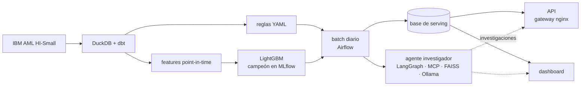

# Atalayero

Monitoreo transaccional contra el lavado de activos, construido de punta a punta en un portátil:
reglas versionadas, un modelo LightGBM, un agente investigador con LLM medido contra un baseline
que decide solo con el score, un batch diario calendarizado en Airflow, una API de solo lectura
detrás de un gateway y un dashboard de monitoreo. Sin servicios en la nube; los modelos de lenguaje
corren en local.

[English](README.md)

> **Solo datos sintéticos.** Todas las cifras vienen de la simulación IBM AML (HI-Small).
> Demuestran diseño, rigor y operación, no desempeño sobre transacciones reales. Ver la
> [ficha de datos](docs/data_card.md) (en inglés).

## Resultados

En los días de test (9 y 10 de septiembre de 2022), sobre los que no se ajustó nada:

| Qué | Resultado | Baseline |
| --- | --- | --- |
| LightGBM, al volumen de alertas de las reglas (85,5 al día) | **21,1 %** del lavado detectado, fuera de las cuentas hub | Reglas R01–R04: 7,8 % |
| Agente investigador v1.4, 180 alertas del golden set | **68,3 %** de aciertos | Solo el score: 68,9 % |
| Batch diario, cola de alertas (100 del modelo al día más las de las reglas) | 160 alertas al día; 35 % sin lavado; cubren el 24 % del lavado del día | — |

- **El modelo le gana a las reglas** al mismo volumen; Isolation Forest no
  ([model card](docs/model_card.md)).
- **El agente no le gana al score solo: pierde por una alerta.** Sus 180 reportes citan solo
  transacciones que existen, con los montos correctos, pero acierta la tipología en 4 de 60 casos
  con patrón ([evaluación del agente](docs/agent_eval.md)).
- **Ningún detector atrapa, con un presupuesto práctico, el lavado que no pertenece a un intento
  documentado.** Es el 38 % del lavado del dataset.

## Cómo funciona



- **Sin fuga temporal:** una feature de una transacción en el instante t usa solo datos anteriores
  a t, incluidas las de grafo; los splits son temporales.
- **Las reglas son configuración:** los umbrales viven en archivos YAML versionados con su
  historial de cambios.
- **Todo detector se mide contra un baseline:** los modelos contra las reglas, el agente contra el
  score solo, con el mismo presupuesto de alertas.
- **El agente no puede ver la respuesta:** sus herramientas son de solo lectura, cortadas al final
  del día de la alerta, y nunca exponen una etiqueta.
- **Operado como producto:** Airflow repite la simulación día a día, reentrena cuando detecta
  deriva y solo promueve un modelo que le gane al campeón. La API es de solo lectura, con límites
  de tasa y API keys.

Más en la [arquitectura](docs/architecture.md) y en los 24 [registros de decisiones](docs/adr/)
(en inglés).

## Cómo correrlo

Requiere WSL2 (Ubuntu), Docker Desktop, [uv](https://docs.astral.sh/uv/) y una GPU NVIDIA de
16 GB para el agente.

```bash
make setup      # dependencias
make pipeline   # descarga el dataset, construye, entrena y evalúa (~17 min)
make up         # Airflow :8080, API :8000, dashboard :8501, Ollama, Redpanda
make llm        # descarga los modelos locales fijados
make knowledge  # indexa las notas de tipologías
make replay     # el batch diario sobre el 1–10 de septiembre (o activarlo en Airflow)
```

Luego abre el dashboard en http://localhost:8501. El [runbook](docs/runbook.md) cubre la operación
y la solución de problemas; `CLAUDE.md` lista todos los comandos.

## Documentación

Todos los documentos están en inglés, salvo el diseño original ([`docs/design.md`](docs/design.md)).

| Documento | Qué cubre |
| --- | --- |
| [Arquitectura](docs/architecture.md) | Componentes, flujo de datos, almacenamiento, servicios |
| [Runbook](docs/runbook.md) | Construirlo, correrlo, cambiarlo y arreglarlo |
| [Ficha de datos](docs/data_card.md) | El dataset, sus rarezas y lo que puede demostrar |
| [Model card](docs/model_card.md) | El modelo, su evaluación y sus límites |
| [Evaluación del agente](docs/agent_eval.md) | Cómo se midió el agente y cómo falla |
| [ADRs](docs/adr/) | Cada decisión, con su contexto y consecuencias |

## Fases

| Tag | Fase |
| --- | --- |
| v0.1 | Datos: ingesta, modelos dbt, replay en streaming de las reglas |
| v0.2 | Reglas y modelos: features point-in-time, evaluación por presupuesto de alertas, MLflow |
| v0.3 | Agente y evals: herramientas MCP, base de conocimiento de tipologías, evaluación offline |
| v0.4 | Producto y operación: Airflow, API, dashboard, documentación |

## Stack

Python 3.11 · uv · DuckDB · dbt · Redpanda · scikit-learn · LightGBM · networkx · MLflow ·
Optuna · LangGraph · MCP · FAISS · Ollama · FastAPI · nginx · Streamlit · Airflow · Docker Compose ·
GitHub Actions

## Licencia

Código: MIT. El dataset y los fixtures de prueba extraídos de él: CDLA-Sharing-1.0
([atribución](tests/fixtures/README.md)).
