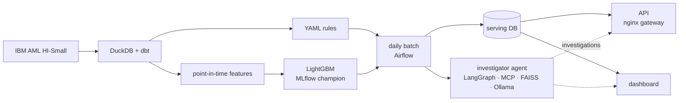

# Atalayero

Transaction monitoring for anti-money laundering, built end to end on one laptop: versioned rules,
a LightGBM model, an LLM investigator agent measured against a score-only baseline, a daily batch
scheduled in Airflow, a read-only API behind a gateway, and a monitoring dashboard. No cloud
services; the language models run locally.

[Español](README.es.md)

> **Synthetic data only.** Every number here comes from the IBM AML simulation (HI-Small). It
> shows design, rigour and operation, not performance on real transactions. See the
> [data card](docs/data_card.md).

## Results

On the test days (9–10 Sep 2022), on which nothing was tuned:

| What | Result | Baseline |
| --- | --- | --- |
| LightGBM, at the rules' alert volume (85.5 a day) | **21.1%** of the laundering detected, outside hub accounts | Rules R01–R04: 7.8% |
| Investigator agent v1.4, 180 golden alerts | **68.3%** right | Score alone: 68.9% |
| Daily batch, alert queue (100 model alerts a day plus the rules') | 160 alerts a day; 35% hold no laundering; they cover 24% of the day's laundering | — |

- **The model beats the rules** at the same volume; Isolation Forest does not
  ([model card](docs/model_card.md)).
- **The agent does not beat the score alone: it loses by one alert.** All 180 of its reports cite
  only transactions that exist, with the right amounts, but it names the right typology in 4 of
  60 patterned cases ([agent evaluation](docs/agent_eval.md)).
- **No detector here catches laundering that belongs to no documented attempt** at a practical
  budget. That is 38% of the dataset's laundering.

## How it works



- **No temporal leakage:** a feature for a transaction at time t uses only data from before t,
  graph features included; splits are by time.
- **Rules are config:** thresholds live in versioned YAML files with a history of changes.
- **Every detector faces a baseline:** models against the rules, the agent against the score
  alone, at the same alert budget.
- **The agent cannot see the answer:** its tools are read-only, cut at the end of the alert's day,
  and never expose a label.
- **Operated like a product:** Airflow replays the simulation day by day, retrains when drift is
  detected, and promotes a model only if it beats the champion. The API is read-only, behind
  rate limits and API keys.

More in [architecture](docs/architecture.md) and in the 24 [decision records](docs/adr/).

## Run it

Requires WSL2 (Ubuntu), Docker Desktop, [uv](https://docs.astral.sh/uv/), and an NVIDIA GPU with
16 GB for the agent.

```bash
make setup      # dependencies
make pipeline   # download the dataset, build, train and evaluate (~17 min)
make up         # Airflow :8080, API :8000, dashboard :8501, Ollama, Redpanda
make llm        # pull the pinned local models
make knowledge  # index the typology notes
make replay     # the daily batch over 1–10 Sep (or unpause it in Airflow)
```

Then open the dashboard at http://localhost:8501. The [runbook](docs/runbook.md) covers
operation and troubleshooting; `CLAUDE.md` lists every command.

## Documentation

| Document | What it covers |
| --- | --- |
| [Architecture](docs/architecture.md) | Components, data flow, storage, services |
| [Runbook](docs/runbook.md) | Building, running, changing and fixing it |
| [Data card](docs/data_card.md) | The dataset, its quirks, and what it can show |
| [Model card](docs/model_card.md) | The scorer, its evaluation and its limits |
| [Agent evaluation](docs/agent_eval.md) | How the agent was measured, and how it fails |
| [ADRs](docs/adr/) | Every decision, with its context and consequences |

## Phases

| Tag | Phase |
| --- | --- |
| v0.1 | Data: ingestion, dbt models, streaming replay of rules |
| v0.2 | Rules and models: point-in-time features, alert-budget evaluation, MLflow |
| v0.3 | Agent and evals: MCP tools, typology knowledge base, offline evaluation |
| v0.4 | Product and operation: Airflow, API, dashboard, documentation |

## Stack

Python 3.11 · uv · DuckDB · dbt · Redpanda · scikit-learn · LightGBM · networkx · MLflow ·
Optuna · LangGraph · MCP · FAISS · Ollama · FastAPI · nginx · Streamlit · Airflow · Docker Compose ·
GitHub Actions

## License

Code: MIT. The dataset and the test fixtures sampled from it: CDLA-Sharing-1.0
([attribution](tests/fixtures/README.md)).
