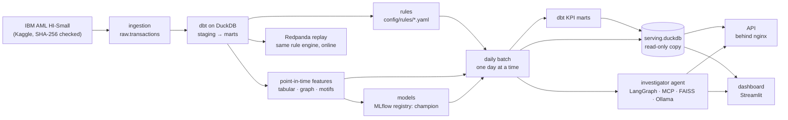

# Architecture

Atalayero is a transaction monitor that runs on one laptop. Versioned rules and a LightGBM model
score a synthetic dataset day by day. An LLM agent investigates the top alerts. An API and a
dashboard serve what the batch decided. Everything runs locally, with no cloud services.

This page shows how the parts fit. The reasons behind them are in the [ADRs](adr/); each section
names the ones it rests on.

## The flow

1. **Ingestion** downloads the dataset, checks it, and loads DuckDB with typed transactions and
   the documented laundering attempts (ADR-0001, ADR-0002).
2. **dbt** builds staging, intermediate and mart models: amounts in USD, account legs, daily
   activity, labels kept in their own mart (ADR-0003).
3. **Rules** are YAML files with versions and a history. One engine evaluates them over the batch
   and over a Kafka replay in Redpanda (ADR-0004, ADR-0006).
4. **Features** for a transaction at time t use only data from before t, graph features included
   (ADR-0008, ADR-0011, ADR-0013).
5. **Models** are trained on a temporal split, compared with the rules at the same alert budget,
   logged to MLflow, and promoted only if they beat the champion (ADR-0005, ADR-0007, ADR-0009,
   ADR-0014).
6. **The daily batch** replays the simulation one day at a time: features, rule alerts, champion
   scores, the alert queue, and drift against train (ADR-0012, ADR-0020). dbt then builds the KPI
   marts, and the batch publishes a new serving database.
7. **The investigator agent** reads an alert through read-only tools served over MCP, cut at the
   end of the alert's day. It searches typology notes in FAISS, and writes a report whose citations
   are checked (ADR-0015 to ADR-0019). On the batch, it investigates the top of a day's queue by
   hand (ADR-0024).
8. **The API and the dashboard** read only the serving database (ADR-0022, ADR-0023).

## Time

The dataset covers 1–18 Sep 2022. Only 1–10 Sep is used: the later days hold little more than
the tails of laundering attempts (ADR-0005).

| Days | Role |
| --- | --- |
| 1 Sep | Warm-up: history for the first features; never scored |
| 2–6 Sep | Train |
| 7–8 Sep | Validation: model choice, thresholds, the agent's dev set |
| 9–10 Sep | Test: run once (ADR-0014), the agent's golden set |

Airflow's logical date is a simulated day. Every day is scored by the registered champion, so
train days are in-sample, and the KPIs and the dashboard say so.

## Storage

| Store | Written by | Read by |
| --- | --- | --- |
| `data/atalayero.duckdb` | ingestion, dbt | everything upstream of serving; the agent's tools (read-only) |
| `data/features/*.parquet` | `make features` | training, the case sets' `explain_score` |
| `data/mlflow/` | training (SQLite registry, artifacts) | the batch, the agent |
| `data/batch/days/<day>/` | the daily batch: features, alerts, scores, queue, drift, state, manifest; the agent's investigations | dbt KPI models, publishing, the agent |
| `data/serving.duckdb` | publishing (replaced atomically) | the API, the dashboard (read-only) |
| `evals/` | case sets and eval reports (versioned in git) | `make eval` |

**DuckDB has one writer at a time.** The batch writes the day's files, dbt writes the KPI marts
into the warehouse, and publishing builds a separate serving database and moves it into place.
Readers never hold a lock the batch needs, and a reader sees one publication or the next, never
half of one (ADR-0020).

## Services

`make up` starts them with Docker Compose, after writing local secrets into `.env` (never
committed).

| Service | What it is | Address |
| --- | --- | --- |
| `redpanda` | Kafka API for the streaming replay | `localhost:19092` |
| `ollama` | Local LLM and embeddings, on the GPU (ADR-0017) | `localhost:11434` |
| `airflow` + `airflow-postgres` | Schedules: `daily_batch`, `drift_monitoring`, `weekly_retrain`, and the manual `investigate_alerts` (ADR-0021, ADR-0024) | `127.0.0.1:8080` |
| `gateway` | nginx in front of the API: throttling, limits, security headers (ADR-0022) | `127.0.0.1:8000` |
| `api` | FastAPI, read-only, API keys; on an internal network with no way out | not published |
| `dashboard` | Streamlit over the KPIs and the queue (ADR-0023) | `127.0.0.1:8501` |

Airflow runs the repository mounted at its own path, read-only except `data/`, with the project's
environment built into its image from `uv.lock`. The API and the dashboard run as an unprivileged
user, with read-only filesystems and no capabilities.

## Rules the code keeps

- **No temporal leakage**: features and agent tools see only data from before their cut-off;
  splits are by time.
- **Thin interfaces**: the DAGs, the API routers, the MCP tools and the dashboard only call
  functions of `src/atalayero/`.
- **Rules are config**: thresholds live in `config/rules/*.yaml`, and a change bumps the version.
- **Shared schemas**: Pydantic models (`Transaction`, `CaseAlert`, `CaseReport`…) are defined once
  in `atalayero.schemas`.
- **Always a baseline**: models against the rules, the agent against the score alone.
