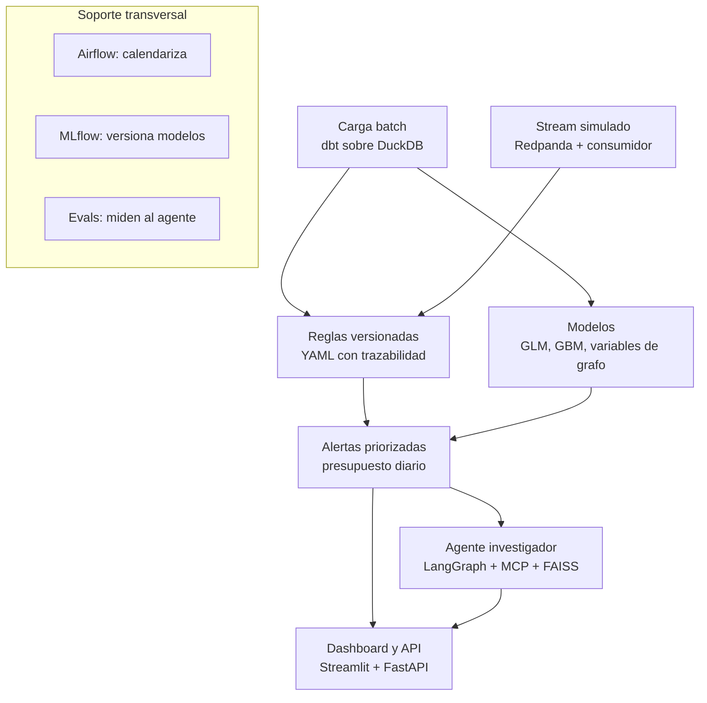

# Atalayero — Proyecto insignia de portafolio (monitoreo de fraude/AML con IA agéntica)

> Sistema de monitoreo transaccional con reglas versionadas, modelos y un agente investigador evaluado. Objetivo: un solo proyecto, por fases publicables, todo en local, que ejercite modelado de datos con dbt, streaming, calendarización, GLM, MLOps, evals de LLM, base vectorial y BI, con foco en datos e IA confiable para finanzas reguladas.

## Fases

| Fase | Qué se construye | Capacidades que ejercita |
| --- | --- | --- |
| 1. Datos | Ingesta batch + stream simulado (Redpanda), dbt en DuckDB | Modelado con dbt, streaming |
| 2. Modelos | Reglas, GLM, gradient boosting con variables de grafo, MLflow, indicadores de fraude | GLM, MLOps, métricas de fraude |
| 3. Agente | Agente investigador con MCP + FAISS y set de evaluación | Evals de LLM, base vectorial, prompt agéntico |
| 4. Producto | FastAPI + Docker, Airflow, dashboard en Streamlit, README en inglés | BI, calendarización, documentación |

## Principios de diseño

- **Costo cero y todo local:** DuckDB, LLMs locales (Ollama o Hugging Face), Streamlit, Airflow y MLflow corren en la máquina. Sin servicios de nube.
- **Cero datos reales:** nada de datos de empleadores ni de personas reales. Solo datos sintéticos públicos.
- **Cada fase se publica sola:** si el proyecto se detiene en la fase 2, ya hay algo terminado que mostrar.
- **Honestidad en el README:** decir qué demuestra un dataset sintético y qué no.

## Arquitectura general



## 1. Datos: batch y streaming

- **Fuente:** dataset *IBM Transactions for Anti Money Laundering* (Kaggle), variante HI-Small. Trae la etiqueta de lavado y un archivo de patrones con 370 intentos en 8 tipologías (fan-out, fan-in, ciclo, bipartito, stack, random, scatter-gather y gather-scatter). El archivo de patrones es el ground truth de tipologías, pero cubre solo 3.209 de las 5.177 transacciones de lavado (62 %); el resto es lavado sin tipología documentada. Licencia CDLA-Sharing-1.0: toda muestra que se redistribuya (p. ej. el fixture de tests) va con el texto de la licencia y la atribución. Descarga anónima por HTTPS con checksum SHA-256, sin token de Kaggle.
- **Batch:** descarga → Parquet → DuckDB. dbt corre sobre DuckDB, el único destino. El pipeline debe recrearse desde cero con un comando.
- **Streaming:** un productor reproduce las transacciones en orden temporal hacia Redpanda (Docker, protocolo Kafka). Un consumidor aplica reglas rápidas en línea y escribe alertas. En la Fase 1 son dos reglas (R02 y R04) en YAML, validadas con un esquema Pydantic mínimo; el motor completo llega en la Fase 2.
- **Capas dbt:** staging (limpieza y tipado), intermediate (actividad diaria por cuenta, aristas cuenta→cuenta), marts (hechos, dimensiones, features, alertas, KPIs).
- **Tests:** unique y not_null, más tests propios: sin timestamps futuros, montos conciliados que cuadran. La frescura de la fuente llega con las cargas programadas de Airflow (fase 4): con un dataset estático no mide nada (ADR-0003).

## 2. Features y reglas

- **Tabulares:** velocidad (transacciones por hora o día), estadísticas de montos, diversidad de contrapartes, mezcla de monedas y formatos de pago.
- **De grafo** (networkx o igraph): grado de entrada y salida en ventana, pertenencia a ciclos cortos, PageRank, comunidad.
- **Regla de oro:** cada feature se calcula solo con datos anteriores al momento de la transacción. Usar el grafo completo filtra información del futuro e infla las métricas. Documentarlo en un ADR.
- **Reglas como configuración versionada:** cada regla es un YAML con dueño, versión e historial de cambios (trazabilidad). Los identificadores (claves, valores, nombres de archivo) van en inglés.

```yaml
id: R02
name: rapid_dispersion
typology: fan_out
owner: aml-monitoring
version: "1.1"
description: Account sending to 10 or more distinct counterparties within 24 h, counting transactions of 5,000 USD or more
metric: distinct_counterparties
window: 24h
threshold:
  min_count: 10
  min_amount_usd: 5000
cooldown: 24h
history:
  - version: "1.0"
    date: 2026-10-04
    reason: "Initial version"
  - version: "1.1"
    date: 2026-10-20
    reason: "Reduce false positives: minimum amount from 1000 to 5000 USD (see ADR-0007)"
```

## 3. Modelos y presupuesto de alertas

- **Comparación con piso sin modelo:** (1) solo reglas como benchmark, (2) regresión logística como GLM interpretable, (3) gradient boosting (LightGBM) con features tabulares y de grafo, (4) Isolation Forest como referencia no supervisada.
- **Partición temporal:** entrenar con los días iniciales y evaluar con los finales, dentro del 1 al 10 de septiembre de 2022. La simulación termina en la práctica el día 10: del 11 al 18 solo quedan colas de intentos de lavado (1.108 transacciones, 59 % de lavado), que inflarían cualquier métrica. Nunca partición aleatoria. El detalle va en el ADR de partición temporal.
- **Métrica central, el presupuesto de alertas:** con N alertas diarias revisables, ¿qué % del lavado se detecta y cuántas alertas son falsos positivos? Curvas de detección vs. volumen de alertas y PR-AUC por el desbalance de clases.
- **MLflow:** registra cada corrida y el modelo campeón.
- **Monitoreo:** PSI de las features entre ventanas y volumen de alertas. Si hay deriva, se dispara reentrenamiento.

## 4. Agente investigador

Recibe una alerta y produce un informe de caso estructurado. Flujo en LangGraph:

1. **Triage:** lee la alerta y el score, decide qué investigar.
2. **Investigación:** ciclo de herramientas vía servidor MCP propio: `get_account_profile`, `get_transactions(cuenta, ventana)`, `get_graph_neighborhood(cuenta, saltos)`, `explain_score` (SHAP), `search_typologies` (FAISS sobre notas propias de tipologías, resumidas con palabras propias a partir de publicaciones públicas de GAFILAT o UIAF).
3. **Redacción:** informe con esquema validado (Pydantic).
4. **Verificación de grounding:** cada transacción citada debe existir y los montos coincidir. Si no, vuelve a investigación.

```python
class CaseReport(BaseModel):
    alert_id: str
    decision: Literal["escalate", "close"]
    typology: Literal[
        "fan_out", "fan_in", "cycle", "bipartite", "stack", "random",
        "scatter_gather", "gather_scatter",
        "unclassified",  # laundering without a clear typology
        "none",  # no laundering
    ]
    evidence: list[str]  # cited transaction IDs
    confidence: float
    narrative: str
```

Solo modelos locales: Ollama por defecto o modelos de Hugging Face ejecutados en local. Sin APIs de pago ni de nube.

## 5. Evaluación del agente (el diferencial)

- **Golden set** de 150–200 alertas con respuesta conocida, en tres grupos que se reportan por separado:
  - **Lavado con patrón documentado:** respuesta `escalate` y la tipología del archivo de patrones.
  - **Lavado sin patrón (casos límite):** respuesta `escalate`, sin tipología de referencia. El 98 % no toca cuentas de los intentos documentados y usa medios de pago variados (los intentos documentados son casi todos ACH): no hay una estructura de manual que reconocer.
  - **Falsos positivos:** transacciones normales que las reglas o el modelo marcaron; respuesta `close`.

  La mezcla de grupos en el golden set es una decisión de diseño, no la prevalencia real.
- **Métricas:** exactitud de decisión (escalate/close) en los tres grupos; exactitud de tipología solo en el lavado con patrón; en el lavado sin patrón, cuántas veces el agente afirma una tipología específica en vez de `unclassified`; tasa de grounding, IDs alucinados por informe, pasos y latencia por caso.
- **Sin acceso a la respuesta:** las herramientas del agente nunca exponen `is_laundering` ni el archivo de patrones.
- **Baseline sin agente:** decidir solo con el score del modelo. Si el agente no le gana, se reporta tal cual.

## 6. Operación y producto

- **Airflow:** DAG de batch diario (ingesta → dbt build → features → scoring → reglas → alertas → KPIs), DAG de reentrenamiento semanal (solo promueve si le gana al campeón), DAG de monitoreo de deriva.
- **FastAPI:** `/score`, `/alerts`, `/cases/{id}`. Todo se levanta con `docker compose up`.
- **Streamlit:** dashboard local sobre las tablas de KPIs en DuckDB: alertas por día, tasa de falsos positivos, % de detección, desempeño por regla, mezcla de tipologías.
- **CI (GitHub Actions):** ruff, pytest, `dbt build` sobre muestra en DuckDB y validación del esquema del último reporte de evals. El LLM no corre en CI; los evals se ejecutan offline y el reporte se versiona.
- **Documentación:** `runbook.md` (guía operativa), ADRs (bitácora de decisiones), `model_card.md`.

## Jerarquía de archivos

```
atalayero/
├── README.md                      # inglés, con diagrama y resultados
├── README.es.md
├── pyproject.toml                 # dependencias con uv
├── Makefile                       # make setup, make pipeline, make eval
├── docker-compose.yml             # redpanda, api, mlflow, airflow, ollama
├── .env.example
├── .pre-commit-config.yaml
├── .github/
│   └── workflows/
│       └── ci.yml
├── config/
│   ├── settings.yaml              # rutas, ventanas, presupuesto de alertas
│   └── rules/
│       ├── R01_rapid_concentration.yaml   # fan-in; sustituye a structuring (ADR-0006)
│       ├── R02_rapid_dispersion.yaml
│       ├── R03_short_cycle.yaml
│       └── R04_high_velocity.yaml
├── data/                          # en .gitignore
│   └── README.md                  # cómo descargar el dataset
├── src/atalayero/
│   ├── ingestion/
│   │   ├── download.py
│   │   └── load_batch.py
│   ├── streaming/
│   │   ├── producer.py            # replay en orden temporal
│   │   └── consumer.py            # reglas en línea
│   ├── features/
│   │   ├── tabular.py
│   │   └── graph.py               # solo con datos pasados
│   ├── rules/
│   │   ├── schema.py              # validación del YAML
│   │   └── engine.py
│   ├── models/
│   │   ├── train.py
│   │   ├── evaluate.py            # detección vs presupuesto de alertas
│   │   └── registry.py            # MLflow
│   ├── monitoring/
│   │   ├── drift.py               # PSI
│   │   └── kpis.py
│   ├── agent/
│   │   ├── graph.py               # nodos de LangGraph
│   │   ├── schemas.py             # CaseReport
│   │   ├── grounding.py
│   │   └── prompts/
│   │       ├── triage.md
│   │       └── investigate.md
│   ├── mcp_server/
│   │   └── server.py              # herramientas del agente
│   ├── knowledge/
│   │   └── build_index.py         # índice FAISS
│   └── api/
│       ├── main.py
│       └── routers/
├── dbt/
│   ├── dbt_project.yml
│   ├── profiles.yml.example       # target duckdb
│   ├── models/
│   │   ├── staging/
│   │   ├── intermediate/
│   │   └── marts/
│   ├── tests/                     # tests propios
│   └── seeds/
│       └── typologies.csv
├── airflow/
│   └── dags/
│       ├── daily_batch.py
│       ├── weekly_retrain.py
│       └── drift_monitoring.py
├── knowledge_base/
│   └── typologies/                # notas propias de tipologías
├── evals/
│   ├── build_golden_set.py
│   ├── golden_set.jsonl
│   ├── run_agent_eval.py
│   ├── metrics.py
│   └── reports/                   # versionados, con fecha
├── notebooks/
│   ├── 01_eda.ipynb
│   ├── 02_baselines.ipynb
│   └── 03_error_analysis.ipynb
├── tests/
│   ├── unit/
│   └── integration/
├── dashboard/
│   └── app.py                     # Streamlit; solo llama funciones de src/atalayero
└── docs/
    ├── architecture.md
    ├── adr/
    │   ├── 0001-batch-ingestion.md
    │   ├── 0002-laundering-attempts-and-story-fixture.md
    │   ├── 0003-dbt-models.md
    │   ├── 0004-streaming-replay-and-online-rules.md
    │   └── 0005-temporal-split.md
    ├── model_card.md
    ├── data_card.md
    ├── agent_eval.md
    └── runbook.md                 # guía operativa
```

## Plan por fases

Fechas tentativas a medio tiempo (8 semanas). Cada fase cierra con un tag (v0.1 a v0.4) y un post en LinkedIn.

### Fase 1 — Datos (5 de octubre de 2026 → 18 de octubre de 2026)

- [x]  Crear el repo con la estructura base, `pyproject.toml`, Makefile y pre-commit
- [x]  Descargar el dataset HI-Small y documentar la descarga en `data/README.md`
- [x]  Carga batch a Parquet y a DuckDB
- [x]  Modelos dbt staging, intermediate y marts con tests estándar y propios
- [x]  Productor y consumidor en Redpanda con dos reglas en línea (umbrales en YAML)
- [x]  CI con ruff, pytest y `dbt build` sobre muestra
- [x]  ADR de partición temporal (ADR-0005)
- [x]  Tag v0.1
- [ ]  Post sobre el pipeline reproducible

### Fase 2 — Reglas y modelos (19 de octubre de 2026 → 1 de noviembre de 2026)

- [x]  Motor de reglas YAML con validación de esquema (4 reglas iniciales; amplía el esquema mínimo de la Fase 1)
- [x]  Features tabulares y de grafo sin fuga temporal (ADR propio)
- [x]  Baselines: solo reglas, regresión logística, LightGBM, Isolation Forest
- [x]  Evaluación por presupuesto de alertas: detección, falsos positivos, PR-AUC
- [x]  Tracking y registro en MLflow
- [x]  Monitoreo de deriva con PSI
- [x]  `model_card.md` y notebook de análisis de errores
- [ ]  Tag v0.2 y post con el resultado de detección vs. presupuesto de alertas

### Fase 3 — Agente y evals (2 de noviembre de 2026 → 15 de noviembre de 2026)

- [x]  Escribir notas propias de tipologías e indexarlas en FAISS
- [x]  Servidor MCP con las cinco herramientas
- [x]  Grafo de LangGraph: triage, investigación, redacción, verificación de grounding
- [x]  Esquema `CaseReport` con Pydantic
- [x]  Golden set de 150–200 alertas en tres grupos: lavado con patrón, lavado sin patrón y falsos positivos
- [x]  Runner de evals y métricas; comparación contra baseline sin agente
- [x]  `agent_eval.md` con resultados y errores típicos
- [ ]  Tag v0.3 y post: cuánto se equivoca el agente y cómo se midió

### Fase 4 — Producto y operación (16 de noviembre de 2026 → 29 de noviembre de 2026)

- [x]  DAGs de Airflow: batch diario, reentrenamiento semanal, deriva
- [x]  API con FastAPI y `docker compose up` de punta a punta
- [x]  Dashboard en Streamlit sobre la tabla de KPIs en DuckDB
- [x]  `runbook.md`, `architecture.md` y `data_card.md`
- [x]  README en inglés con diagrama y resultados, y versión en español
- [ ]  Tag v0.4 y post de cierre del proyecto

## Trampas a evitar

- **Fuga temporal en las features de grafo:** la que más tumba proyectos así.
- **Los días 11 a 18 de septiembre:** son casi solo colas de intentos de lavado; usarlos para evaluar infla las métricas.
- **Ampliar el alcance antes de cerrar la fase:** la fase 1 publicada antes de tocar el agente.
- **Prometer de más en el README:** es un dataset sintético; demuestra diseño, rigor y operación, no desempeño en datos reales.
