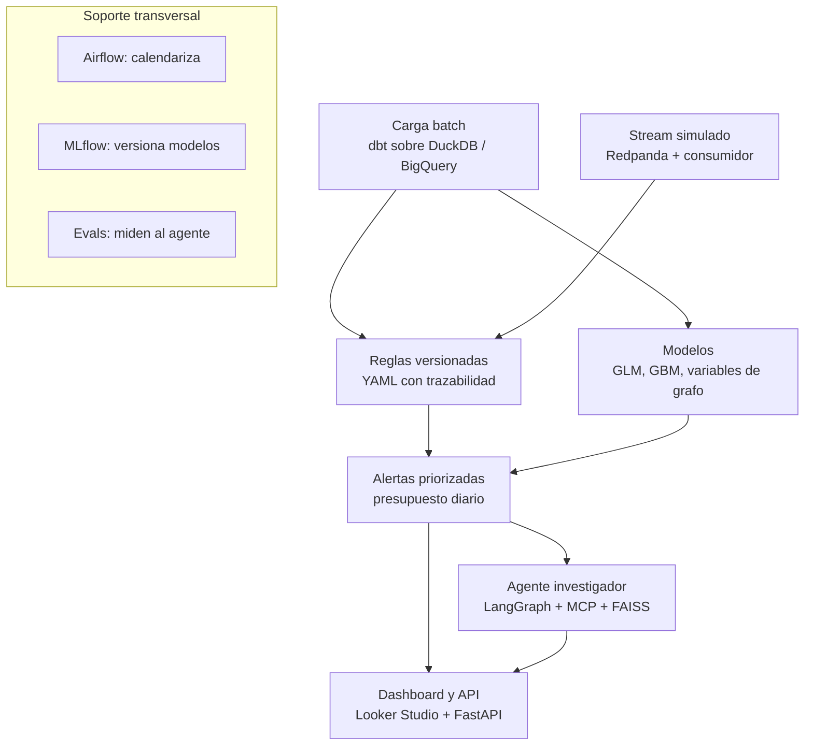

# Atalayero — Proyecto insignia de portafolio (monitoreo de fraude/AML con IA agéntica)

> Sistema de monitoreo transaccional con reglas versionadas, modelos y un agente investigador evaluado. Objetivo: un solo proyecto, por fases publicables, que ejercite BigQuery, streaming, calendarización, GLM, MLOps, evals de LLM, base vectorial y BI, con foco en datos e IA confiable para finanzas reguladas.

## Fases

| Fase | Qué se construye | Capacidades que ejercita |
| --- | --- | --- |
| 1. Datos | Ingesta batch + stream simulado (Redpanda), dbt en DuckDB y BigQuery, Airflow | GCP/BigQuery, streaming, calendarización |
| 2. Modelos | Reglas, GLM, gradient boosting con variables de grafo, MLflow, indicadores de fraude | GLM, MLOps, métricas de fraude |
| 3. Agente | Agente investigador con MCP + FAISS y set de evaluación | Evals de LLM, base vectorial, prompt agéntico |
| 4. Producto | FastAPI + Docker, dashboard en Looker Studio, README en inglés | BI, Looker Studio, documentación |

## Principios de diseño

- **Costo cero:** modelos locales con Ollama, sandbox de BigQuery, Looker Studio, Airflow y MLflow en local.
- **Cero datos reales:** nada de datos de empleadores ni de personas reales. Solo datos sintéticos públicos.
- **Cada fase se publica sola:** si el proyecto se detiene en la fase 2, ya hay algo terminado que mostrar.
- **Honestidad en el README:** decir qué demuestra un dataset sintético y qué no.

## Arquitectura general



## 1. Datos: batch y streaming

- **Fuente:** dataset *IBM Transactions for Anti Money Laundering* (Kaggle), variante HI-Small. Trae la etiqueta de lavado y un archivo de patrones (fan-out, fan-in, ciclos, scatter-gather). El archivo de patrones es el ground truth para evaluar al agente. Revisar la licencia antes de publicar derivados.
- **Batch:** descarga → Parquet → carga. Mismo código dbt con dos destinos: DuckDB para desarrollo y BigQuery como destino productivo. El sandbox tiene límites (p. ej. expiración de tablas), así que el pipeline debe recrearse desde cero con un comando.
- **Streaming:** un productor reproduce las transacciones en orden temporal hacia Redpanda (Docker, protocolo Kafka). Un consumidor aplica reglas rápidas en línea y escribe alertas.
- **Capas dbt:** staging (limpieza y tipado), intermediate (actividad diaria por cuenta, aristas cuenta→cuenta), marts (hechos, dimensiones, features, alertas, KPIs).
- **Tests:** unique y not_null, más tests propios: sin timestamps futuros, montos conciliados que cuadran, frescura de la fuente.

## 2. Features y reglas

- **Tabulares:** velocidad (transacciones por hora o día), estadísticas de montos, diversidad de contrapartes, mezcla de monedas y formatos de pago.
- **De grafo** (networkx o igraph): grado de entrada y salida en ventana, pertenencia a ciclos cortos, PageRank, comunidad.
- **Regla de oro:** cada feature se calcula solo con datos anteriores al momento de la transacción. Usar el grafo completo filtra información del futuro e infla las métricas. Documentarlo en un ADR.
- **Reglas como configuración versionada:** cada regla es un YAML con dueño, versión e historial de cambios (trazabilidad).

```yaml
id: R02
nombre: dispersion_rapida
tipologia: fan_out
version: 1.2
descripcion: Cuenta que envía a 10 o más contrapartes distintas en 24 h
ventana: 24h
umbral:
  contrapartes_distintas: 10
  monto_minimo: 5000
historial:
  - version: 1.2
    fecha: 2026-10-20
    motivo: "Reducir falsos positivos: monto mínimo de 1000 a 5000 (ver ADR-0007)"
```

## 3. Modelos y presupuesto de alertas

- **Comparación con piso sin modelo:** (1) solo reglas como benchmark, (2) regresión logística como GLM interpretable, (3) gradient boosting (LightGBM) con features tabulares y de grafo, (4) Isolation Forest como referencia no supervisada.
- **Partición temporal:** entrenar con semanas iniciales, evaluar con las finales. Nunca partición aleatoria.
- **Métrica central, el presupuesto de alertas:** con N alertas diarias revisables, ¿qué % del lavado se detecta y cuántas alertas son falsos positivos? Curvas de detección vs. volumen de alertas y PR-AUC por el desbalance de clases.
- **MLflow:** registra cada corrida y el modelo campeón.
- **Monitoreo:** PSI de las features entre ventanas y volumen de alertas. Si hay deriva, se dispara reentrenamiento.

## 4. Agente investigador

Recibe una alerta y produce un informe de caso estructurado. Flujo en LangGraph:

1. **Triage:** lee la alerta y el score, decide qué investigar.
2. **Investigación:** ciclo de herramientas vía servidor MCP propio: `get_account_profile`, `get_transactions(cuenta, ventana)`, `get_graph_neighborhood(cuenta, saltos)`, `explain_score` (SHAP), `search_typologies` (FAISS sobre notas propias de tipologías, resumidas con palabras propias a partir de publicaciones públicas de GAFILAT o UIAF).
3. **Redacción:** informe con esquema validado (Pydantic).
4. **Verificación de grounding:** cada transacción citada debe existir y los montos coincidir. Si no, vuelve a investigación.

```python
class CaseReport(BaseModel):
    alert_id: str
    decision: Literal["escalar", "cerrar"]
    tipologia: Literal["fan_out", "fan_in", "ciclo", "scatter_gather", "ninguna"]
    evidencia: list[str]   # IDs de transacciones citadas
    confianza: float
    narrativa: str
```

Modelo por defecto local (Ollama) para mantener costo cero. API de Claude solo como comparación opcional (tiene costo).

## 5. Evaluación del agente (el diferencial)

- **Golden set** de 150–200 alertas con respuesta conocida (lavado sí/no y tipología, del archivo de patrones).
- **Métricas:** exactitud de decisión (escalar/cerrar), exactitud de tipología, tasa de grounding, IDs alucinados por informe, pasos y latencia por caso.
- **Baseline sin agente:** decidir solo con el score del modelo. Si el agente no le gana, se reporta tal cual.

## 6. Operación y producto

- **Airflow:** DAG de batch diario (ingesta → dbt build → features → scoring → reglas → alertas → KPIs), DAG de reentrenamiento semanal (solo promueve si le gana al campeón), DAG de monitoreo de deriva.
- **FastAPI:** `/score`, `/alerts`, `/cases/{id}`. Todo se levanta con `docker compose up`.
- **Looker Studio:** alertas por día, tasa de falsos positivos, % de detección, desempeño por regla, mezcla de tipologías.
- **CI (GitHub Actions):** ruff, pytest, `dbt build` sobre muestra en DuckDB y validación del esquema del último reporte de evals. El LLM no corre en CI; los evals se ejecutan offline y el reporte se versiona.
- **Documentación:** `runbook.md` (guía operativa), ADRs (bitácora de decisiones), `model_card.md`.

## Jerarquía de archivos

```
atalayero/
├── README.md                      # inglés, con diagrama y resultados
├── README.es.md
├── pyproject.toml                 # dependencias con uv
├── Makefile                       # make setup, make pipeline, make eval
├── docker-compose.yml             # redpanda, api, mlflow, airflow, ollama
├── .env.example
├── .pre-commit-config.yaml
├── .github/
│   └── workflows/
│       └── ci.yml
├── config/
│   ├── settings.yaml              # rutas, ventanas, presupuesto de alertas
│   └── rules/
│       ├── R01_fraccionamiento.yaml
│       ├── R02_dispersion_rapida.yaml
│       ├── R03_ciclo_corto.yaml
│       └── R04_velocidad_alta.yaml
├── data/                          # en .gitignore
│   └── README.md                  # cómo descargar el dataset
├── src/atalayero/
│   ├── ingestion/
│   │   ├── download.py
│   │   └── load_batch.py
│   ├── streaming/
│   │   ├── producer.py            # replay en orden temporal
│   │   └── consumer.py            # reglas en línea
│   ├── features/
│   │   ├── tabular.py
│   │   └── graph.py               # solo con datos pasados
│   ├── rules/
│   │   ├── schema.py              # validación del YAML
│   │   └── engine.py
│   ├── models/
│   │   ├── train.py
│   │   ├── evaluate.py            # detección vs presupuesto de alertas
│   │   └── registry.py            # MLflow
│   ├── monitoring/
│   │   ├── drift.py               # PSI
│   │   └── kpis.py
│   ├── agent/
│   │   ├── graph.py               # nodos de LangGraph
│   │   ├── schemas.py             # CaseReport
│   │   ├── grounding.py
│   │   └── prompts/
│   │       ├── triage.md
│   │       └── investigate.md
│   ├── mcp_server/
│   │   └── server.py              # herramientas del agente
│   ├── knowledge/
│   │   └── build_index.py         # índice FAISS
│   └── api/
│       ├── main.py
│       └── routers/
├── dbt/
│   ├── dbt_project.yml
│   ├── profiles.yml.example       # targets duckdb y bigquery
│   ├── models/
│   │   ├── staging/
│   │   ├── intermediate/
│   │   └── marts/
│   ├── tests/                     # tests propios
│   └── seeds/
│       └── typologies.csv
├── airflow/
│   └── dags/
│       ├── daily_batch.py
│       ├── weekly_retrain.py
│       └── drift_monitoring.py
├── knowledge_base/
│   └── typologies/                # notas propias de tipologías
├── evals/
│   ├── build_golden_set.py
│   ├── golden_set.jsonl
│   ├── run_agent_eval.py
│   ├── metrics.py
│   └── reports/                   # versionados, con fecha
├── notebooks/
│   ├── 01_eda.ipynb
│   ├── 02_baselines.ipynb
│   └── 03_error_analysis.ipynb
├── tests/
│   ├── unit/
│   └── integration/
├── dashboards/
│   └── looker_studio.md           # link y capturas
└── docs/
    ├── architecture.md
    ├── adr/
    │   ├── 0001-particion-temporal.md
    │   ├── 0002-reglas-como-yaml.md
    │   └── 0003-features-de-grafo-sin-fuga.md
    ├── model_card.md
    ├── data_card.md
    ├── agent_eval.md
    └── runbook.md                 # guía operativa
```

## Plan por fases

Fechas tentativas a medio tiempo (8 semanas). Cada fase cierra con un tag (v0.1 a v0.4) y un post en LinkedIn.

### Fase 1 — Datos (5 de octubre de 2026 → 18 de octubre de 2026)

- [ ]  Crear el repo con la estructura base, `pyproject.toml`, Makefile y pre-commit
- [ ]  Descargar el dataset HI-Small y documentar la descarga en `data/README.md`
- [ ]  Carga batch a Parquet y a DuckDB
- [ ]  Modelos dbt staging, intermediate y marts con tests estándar y propios
- [ ]  Configurar el target de BigQuery (sandbox) en `profiles.yml`
- [ ]  Productor y consumidor en Redpanda con dos reglas en línea
- [ ]  CI con ruff, pytest y `dbt build` sobre muestra
- [ ]  ADR-0001 partición temporal
- [ ]  Tag v0.1 y post sobre el pipeline reproducible

### Fase 2 — Reglas y modelos (19 de octubre de 2026 → 1 de noviembre de 2026)

- [ ]  Motor de reglas YAML con validación de esquema (4 reglas iniciales)
- [ ]  Features tabulares y de grafo sin fuga temporal (ADR-0003)
- [ ]  Baselines: solo reglas, regresión logística, LightGBM, Isolation Forest
- [ ]  Evaluación por presupuesto de alertas: detección, falsos positivos, PR-AUC
- [ ]  Tracking y registro en MLflow
- [ ]  Monitoreo de deriva con PSI
- [ ]  `model_card.md` y notebook de análisis de errores
- [ ]  Tag v0.2 y post con el resultado de detección vs. presupuesto de alertas

### Fase 3 — Agente y evals (2 de noviembre de 2026 → 15 de noviembre de 2026)

- [ ]  Escribir notas propias de tipologías e indexarlas en FAISS
- [ ]  Servidor MCP con las cinco herramientas
- [ ]  Grafo de LangGraph: triage, investigación, redacción, verificación de grounding
- [ ]  Esquema `CaseReport` con Pydantic
- [ ]  Golden set de 150–200 alertas a partir del archivo de patrones
- [ ]  Runner de evals y métricas; comparación contra baseline sin agente
- [ ]  `agent_eval.md` con resultados y errores típicos
- [ ]  Tag v0.3 y post: cuánto se equivoca el agente y cómo se midió

### Fase 4 — Producto y operación (16 de noviembre de 2026 → 29 de noviembre de 2026)

- [ ]  DAGs de Airflow: batch diario, reentrenamiento semanal, deriva
- [ ]  API con FastAPI y `docker compose up` de punta a punta
- [ ]  Dashboard en Looker Studio conectado a la tabla de KPIs
- [ ]  `runbook.md`, `architecture.md` y `data_card.md`
- [ ]  README en inglés con diagrama y resultados, y versión en español
- [ ]  Tag v0.4 y post de cierre del proyecto

## Trampas a evitar

- **Fuga temporal en las features de grafo:** la que más tumba proyectos así.
- **Ampliar el alcance antes de cerrar la fase:** la fase 1 publicada antes de tocar el agente.
- **Prometer de más en el README:** es un dataset sintético; demuestra diseño, rigor y operación, no desempeño en datos reales.
